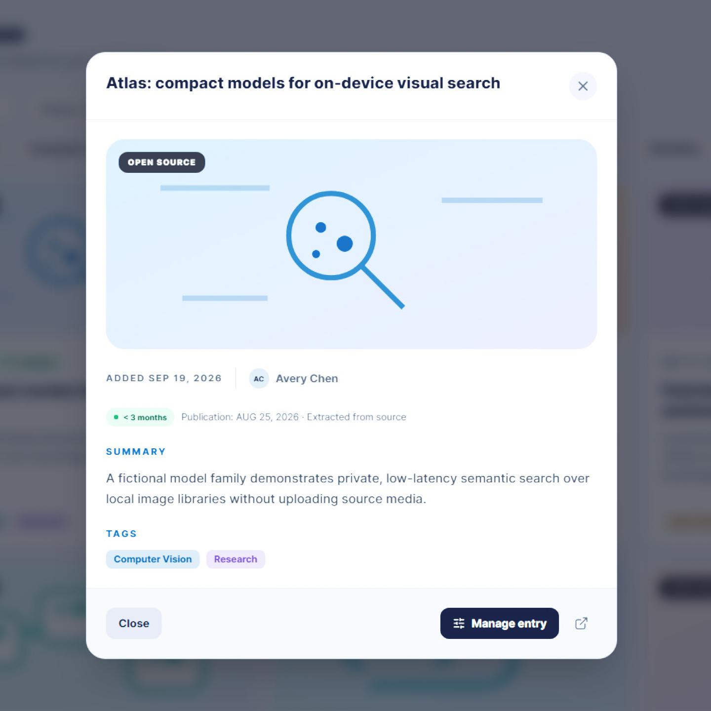
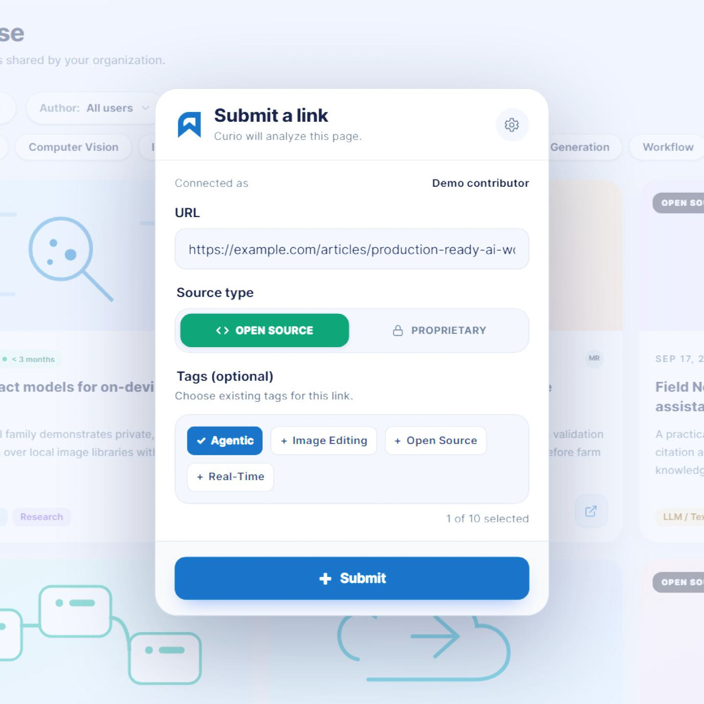
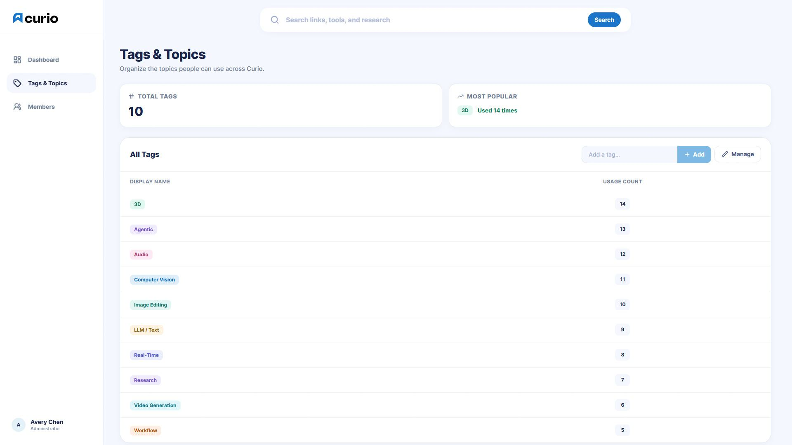
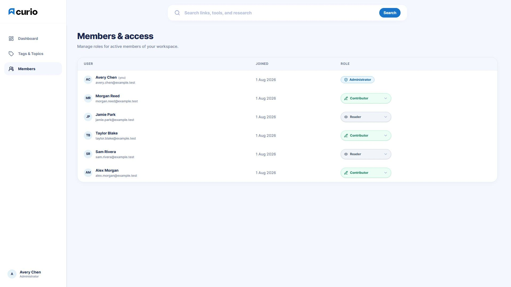

# Product tour and screenshots

https://github.com/user-attachments/assets/8702a16d-eff7-4908-a473-f7af22ddf9e6

The tour uses demo data and simulated extension submissions. Music: **Cipher — Kevin MacLeod**,
edited excerpt under CC BY 4.0. [Full credit](MUSIC-CREDIT.md).

## Files

- [Full tour](Curio%20Full.mp4): 38 seconds, 1080p, with music.
- [Short preview](Curio%20Preview.mp4): 8 seconds, 720p, silent.
- `curio_01.jpg` through `curio_05.jpg`: interface screenshots, without promotional overlays.

The links above open the source files; use the embedded player to watch on GitHub. Editing masters,
previous renders, and separate soundtrack files remain local.

## Screenshots

## Recording again

Start the development server with `CURIO_CAPTURE_MODE=true`, then run `npm run media:capture`,
`node scripts/edit-product-tour.mjs`, and `npm run media:prepare`. Playwright Chromium and FFmpeg
are required. The editor also expects `Cipher-original.mp3` in the artifact directory; see the
[music credit](MUSIC-CREDIT.md).

The capture studio uses fictional data and is disabled in production. The scripts leave the final
`curio_*.jpg` and `Curio *.mp4` exports untouched; final editing and audio assembly are manual.
Inspect new recordings before publishing them and keep the music attribution alongside the video.
